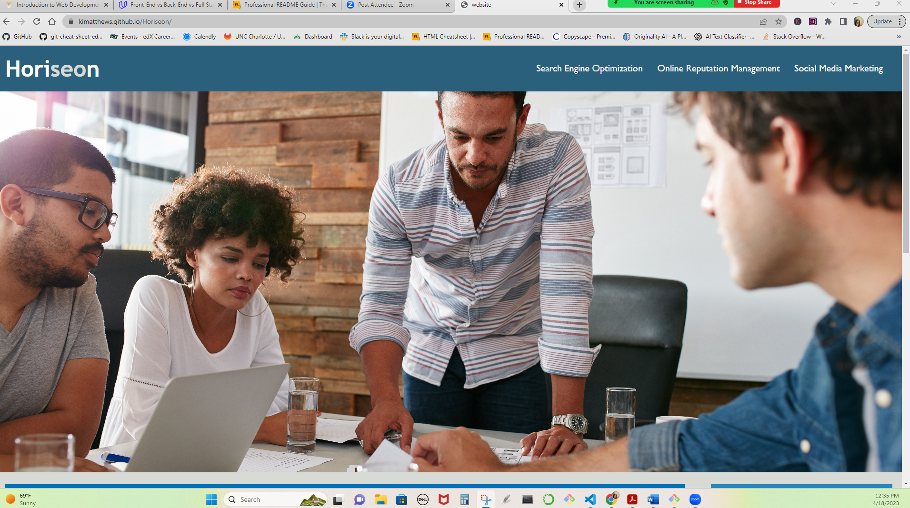

# Horiseon

## Description

A project aimed at improving a website's accessibility for people with disabilities while adhering to the Scout Rule and enhancing the codebase for long-term sustainability. A project aimed at improving a website's accessibility for people with disabilities while adhering to the Scout Rule and enhancing the codebase for long-term sustainability. My primary objective for this project was to enhance the accessibility of a given website by meeting specific criteria provided by the tech lead while adhering to the Scout Rule - leaving the code cleaner than I found it. This project addresses the challenge of improving web accessibility for people with disabilities, ensuring that they can access the website using assistive technologies like video captions, screen readers, and braille keyboards.

## Usage

## Credits

Kawuana Matthews Github: https://github.com/kimatthews